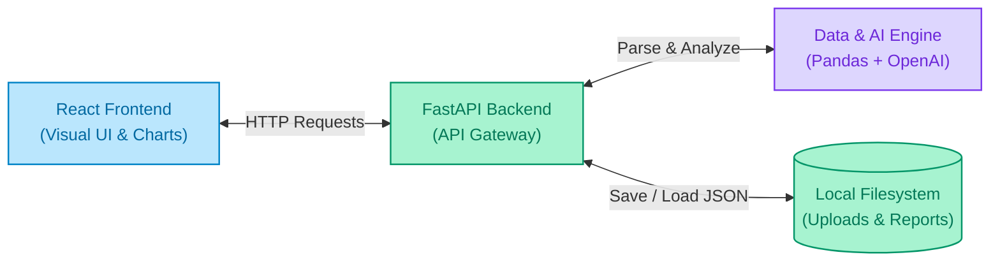

# 📊 InsightFlow AI

InsightFlow AI is an intelligent data profiling and analytics application designed to ingest CSV or Excel spreadsheets, analyze their structure and statistical distributions, and render an interactive dashboard complete with dynamic charts, data signal alerts, and AI-driven business recommendations.

---

## ✨ Features

- **Drag-and-Drop Dataset Ingestion**: Upload `.csv` and `.xlsx` files with automatic frontend and backend validation.
- **Automated Data Profiling**: Instantly extract key metrics like row/column counts, column types, statistics (min, max, average), duplicate counts, missing values, and trend directions using **Pandas**.
- **AI-Powered Insights**: Generates natural language summaries and actionable recommendations based on dataset signals.
- **Fallback Rule-Engine**: Automatically switches to a local rule-based analytical summary if OpenAI is not configured or fails.
- **Interactive Visualizations**: Renders dynamic Bar, Line, and Pie charts using **Recharts** based on observed data columns.

---

## 🏗️ Architecture & Data Flow

InsightFlow AI uses a decoupled client-server structure:



### End-to-End Flow:
1. **Upload**: User drops a file; the React frontend sends it to `/api/v1/upload` which validates and stores it in `data/uploads/`.
2. **Analysis**: The frontend requests `/api/v1/analyze/{upload_id}`. The backend uses Pandas to process statistics and queries OpenAI (or the local fallback) to create insights.
3. **Storage**: The generated analysis payload is stored on the filesystem at `data/reports/{report_id}.json`.
4. **Render**: The frontend requests `/api/v1/dashboard/{report_id}` and visualizes the dashboard.

---

## 🛠️ Getting Started

### 📋 Requirements & Prerequisites
Ensure you have the following installed on your machine:
- **Git** (to clone and manage code)
- **Python 3.10+** (to run the FastAPI backend)
- **Node.js 18+ & npm** (to run the React frontend)
- *Optional:* An **OpenAI API Key** (for AI-backed reports; defaults to a rule-based fallback if not provided)

### 📥 1. Clone the Repository
Clone the repository using Git and navigate to the project directory:
```bash
git clone https://github.com/HamseMoismaila/insightflow-ai.git
cd insightflow-ai
```

### ⚙️ 2. Configuration Setup
Create a `.env` file in the root directory by copying the example template:
```powershell
copy .env.example .env
```
Open `.env` and fill in your variables. 

> [!IMPORTANT]
> Because Pydantic Settings parses list fields as JSON strings, **`ALLOWED_CORS_ORIGINS`** must be formatted as a valid JSON array. For example:
> ```env
> ALLOWED_CORS_ORIGINS=["http://localhost:3000", "http://127.0.0.1:3000"]
> ```

### 🔌 3. Start the Backend Server
From the project root:
```powershell
# Install requirements
python -m pip install -r requirements.txt

# Start the FastAPI server
python -m uvicorn backend.app.main:app --host 127.0.0.1 --port 8000
```
- Backend health endpoint: [http://127.0.0.1:8000/api/v1/health](http://127.0.0.1:8000/api/v1/health)

### 💻 4. Start the Frontend Dev Server
From the `frontend/` directory:
```powershell
# Install dependencies
npm install

# Start the dev server
npm run dev
```
- Frontend application: [http://localhost:3000](http://localhost:3000)

---

## 🧪 Testing

### Running Backend Tests
Ensure your python dependencies are installed, then run the test suite from the root directory:
```powershell
python -m pytest
```

### Running Frontend Checks
From the `frontend/` directory:
```powershell
# Check Typescript compilation
npm run typecheck

# Build for production
npm run build
```

---

## 📂 Folder Structure

```
insightflow-ai/
├── backend/                  # Python FastAPI Backend
│   ├── app/
│   │   ├── api/v1/           # API endpoints (health, upload, analyze, dashboard)
│   │   ├── core/config.py    # Reads environment variables (CORS, keys)
│   │   ├── services/         # Math parsing (Pandas) & AI formatting (OpenAI)
│   │   └── main.py           # Starts the FastAPI application
│   └── tests/                # Automated backend tests (pytest)
│
├── frontend/                 # React 19 Frontend
│   └── src/
│       ├── components/       # UI elements (charts, upload panels, cards)
│       └── App.tsx           # Main page controller
│
└── data/                     # Local storage (created automatically)
    ├── uploads/              # Raw CSV / Excel files you upload
    └── reports/              # Generated JSON reports
```
